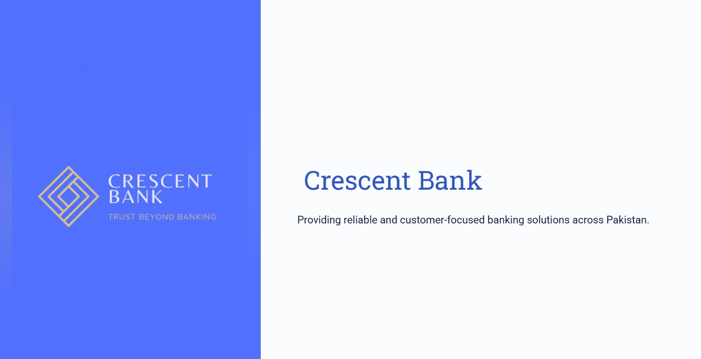
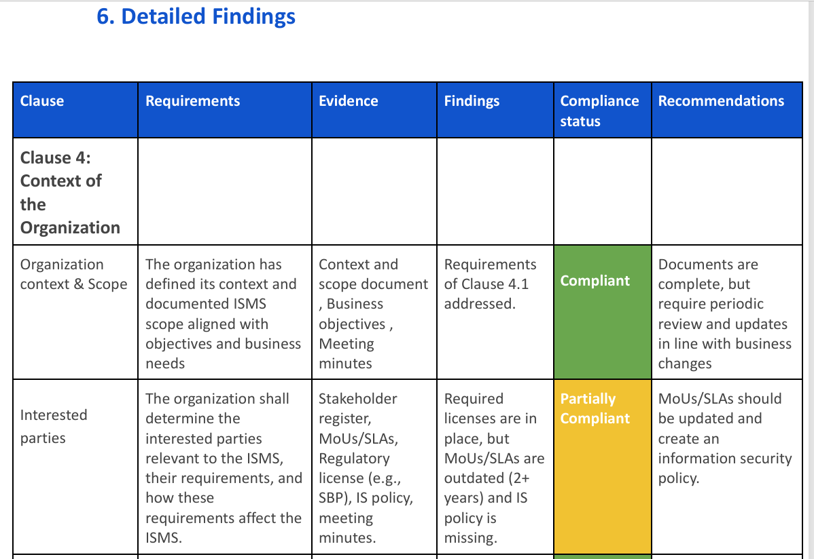
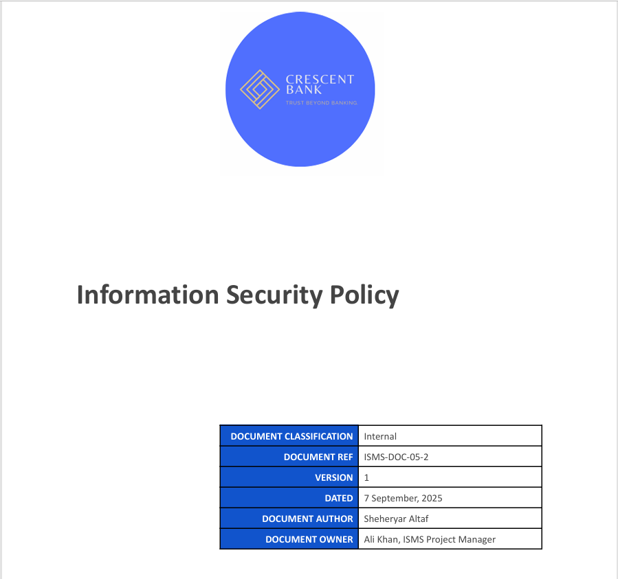
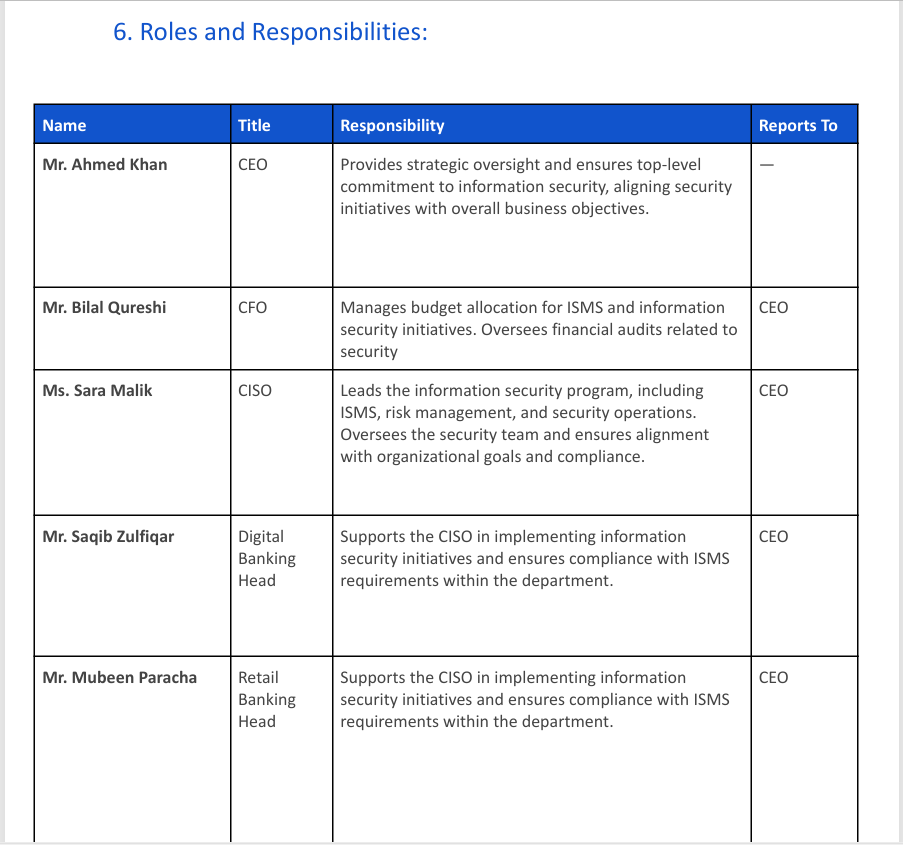

# Crescent Bank – ISO 27001 ISMS GRC Project

---

## Project Title
**ISO/IEC 27001:2022 ISMS Implementation at Crescent Bank**

---

## Project Overview
**Disclaimer:** Crescent Bank is a fictional organization created for educational purposes.  

This project demonstrates a step-by-step implementation of an ISMS following ISO/IEC 27001:2022 standards.  
It includes essential documents for ISO certification, focusing on initiating the ISMS, defining scope, and preparing for risk assessment and Statement of Applicability (SoA).  
It focuses on **Governance, Risk, and Compliance (GRC)** aspects, including risk identification, treatment, and aligning the bank’s policies with regulatory requirements.  

---

## Project Objectives
1. Establish a robust ISMS for the bank  
2. Identify, assess, and treat information security risks  
3. Protect information assets and reduce risk of breaches  
4. Build client trust and support informed decision-making  
5. Prepare for ISO 27001 readiness and align with SBP ETGRM guidelines  

---

## Pictures from the main report have been added here for clarity:

<p align="center">
  
  
</p>

<p align="center">
  
  
</p>


## Repository Structure
```plaintext
crescent-bank-iso27001/
│── README.md
│── 01_Bank_Overview.pdf
│── 02_ISMS_PID.pdf
│── 03_ISMS_Context_Scope.pdf
│── 04_ISMS_Gap_Assessment.pdf
│── 05_Information_Security_Policy.pdf
│── images/
│   ├── Bank_Overview.PNG
│   ├── Gap_Assessment.PNG
│   ├── IS_Policy.PNG
│   └── Roles_and_Responsibilities.PNG
